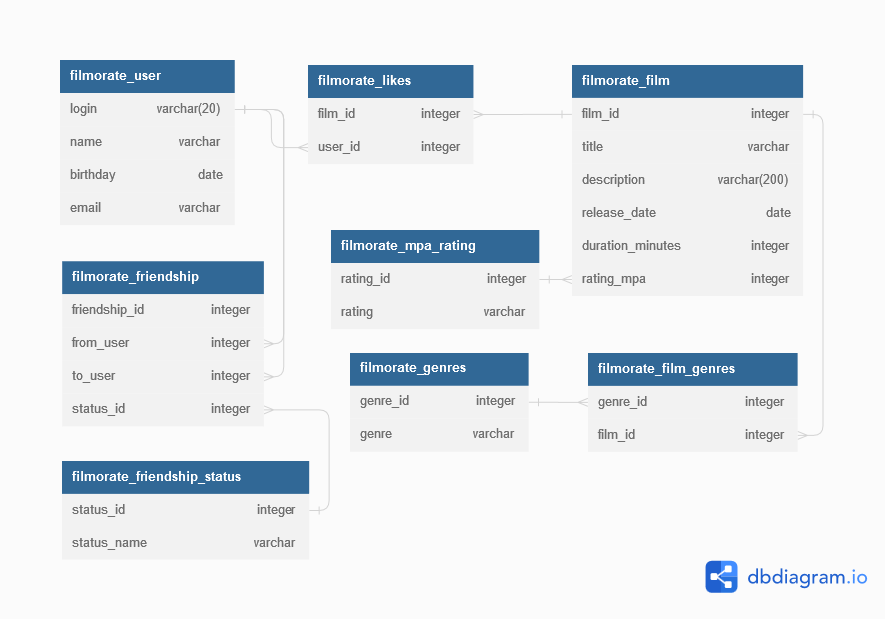

# java-filmorate

Как я понимаю именно сюда можно записать мысли по поводу проектирования БД

И так, у нас есть две важные бизнес сущности это:
 - Фильм
 - Пользователь

Пользователя не обладает функциональностью.
Из фильма выделяются рэйтинг и жанр один объект, это теперь поля фильма.

Это картинка для прощания))))))))))

