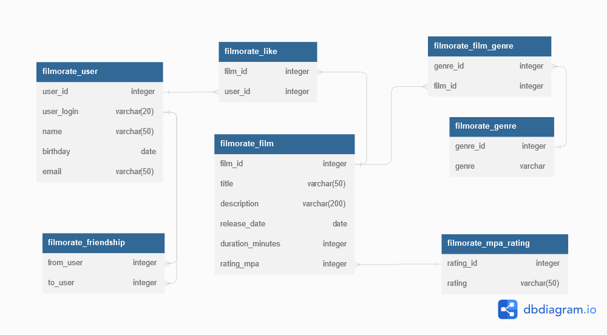

# java-filmorate

Как я понимаю именно сюда можно записать мысли по поводу проектирования БД

И так, у нас есть две важные бизнес сущности это:
 - Фильм
 - Пользователь

Из пользователя пришлось сделать два объекта. Это, собственно,
пользователь и дружба двух пользователей. К дружбе прилагается словарь статусов этой дружбы.
Дружбу нужно будет переносить в контроллер и что бы она там обитала
Из фильма пока что выделился только один объект, это и есть фильм. В теории лайки нужно тоже вытащить
из фильма и заставить жить отдельно. Но пока не оставим так. 

Вопрос стоит следующий. Словари с рейтингами фильмов и статусами дружбы можно сделать 
enum-ами. Они есть и в Postgres и в H2. И как я понял даже синтаксис один. Но на стримах
про такое не говорили, в курсе такого не было. Так что и пока оставлю эту идею.

Я еще не знаю как буду конвертировать словари из БД в энумы Джавы. 
И вообще не понимаю, стоит ли так заморачиваться

Сейчас я попробую создать всё это, 
потестить запросы и скину их сюда.

Подумайте о том, как будет происходить получение всех фильмов,
пользователей. А как — топ N наиболее популярных фильмов.
Или список общих друзей с другим пользователем.

Это картинка для прощания))))))))))

